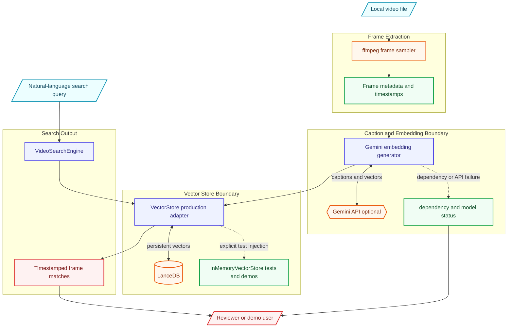

# Architecture

Video indexing pipeline that extracts frames with ffmpeg, captions/embeds them with Gemini, and stores searchable frame vectors in LanceDB with explicit test-store boundaries.

This document is written for reviewers who want to understand how the project is shaped before reading the code. It emphasizes boundaries, dependencies, and degraded paths rather than marketing claims.

## Data Flow

1. Video input
2. ffmpeg frame extraction
3. Gemini captions/embeddings
4. LanceDB vector store
5. Semantic query
6. Timestamped frame results

## Main Components

- **Video processor**: Extracts frames and metadata from local video files.
- **Embedding generator**: Builds frame descriptions and vectors with Gemini when configured.
- **Vector store**: Uses LanceDB in production paths and an explicit in-memory store for tests/demos.
- **Search engine**: Ranks frame matches and returns timestamp/video context.

## External Dependencies

- Python 3.11+
- ffmpeg
- LanceDB
- Optional Gemini API key
- Local video files

The project is intentionally explicit about optional services. Mock, fallback, and degraded paths are labeled in result metadata so a demo cannot be mistaken for a successful production integration.

## Failure And Degraded Modes

- External-service failures are captured as warnings, status fields, or source metadata where the domain model supports it.
- Mock/demo behavior is opt-in or explicitly labeled.
- Generated outputs are treated as review candidates, not authoritative decisions.
- CLI output remains user-facing; library internals use logging or structured metadata.

## What To Review In Code

- Production vector storage fails fast when LanceDB dependencies are missing.
- Tests use explicit InMemoryVectorStore instead of private mock state.
- Docs separate demo behavior from external-service behavior.

## Current Limits

- Quality depends on frame sampling and caption quality.
- Large videos need storage/runtime planning.
- Gemini and LanceDB setup are required for full indexing behavior.
